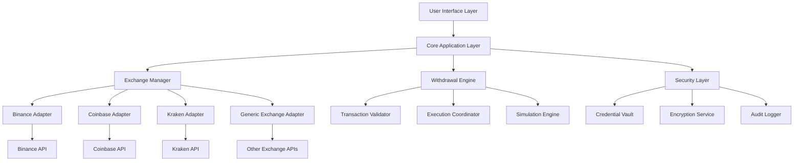
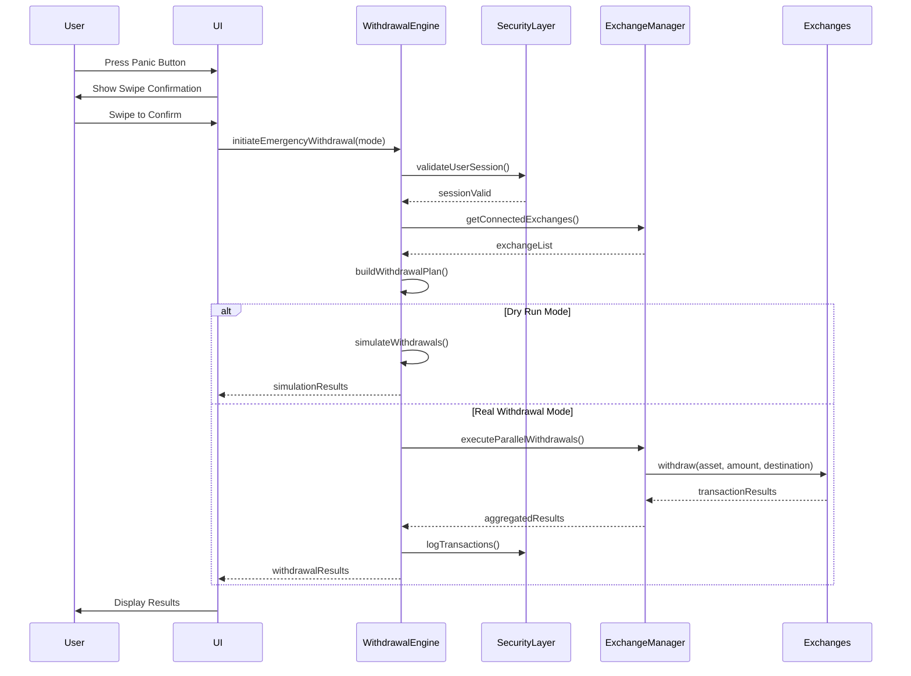

# Design Document: Crypto Panic Button (Coin Escape)

## Overview

The Crypto Panic Button (Coin Escape) is an emergency withdrawal application that enables users to execute rapid, one-click withdrawals from multiple cryptocurrency exchanges simultaneously. The system provides a critical safety mechanism for users to quickly move assets during market emergencies, security threats, or exchange instability. The application supports both simulation mode (dry run) for testing and live execution mode for actual withdrawals, with a secure swipe-to-confirm mechanism to prevent accidental activations.

The system integrates with major cryptocurrency exchanges (Binance, Coinbase, Kraken, and others) through their respective APIs, manages user authentication and API credentials securely, tracks asset allocations across exchanges, and executes parallel withdrawal operations with comprehensive error handling and transaction logging.

## Architecture



## Main Workflow: Emergency Withdrawal




## Components and Interfaces

### Component 1: Exchange Manager

**Purpose**: Manages connections to multiple cryptocurrency exchanges and provides a unified interface for exchange operations.

**Interface**:
```pascal
INTERFACE ExchangeManager
  connectExchange(exchangeId: ExchangeId, credentials: ApiCredentials): ConnectionResult
  disconnectExchange(exchangeId: ExchangeId): Boolean
  getConnectedExchanges(): List<Exchange>
  getExchangeBalances(exchangeId: ExchangeId): BalanceMap
  getAllBalances(): Map<ExchangeId, BalanceMap>
  executeWithdrawal(exchangeId: ExchangeId, request: WithdrawalRequest): WithdrawalResult
  testConnection(exchangeId: ExchangeId): ConnectionStatus
END INTERFACE
```

**Responsibilities**:
- Maintain active connections to configured exchanges
- Abstract exchange-specific API differences through adapters
- Provide unified balance and withdrawal operations
- Handle connection failures and retries
- Validate API credentials and permissions

### Component 2: Withdrawal Engine

**Purpose**: Orchestrates emergency withdrawal operations across multiple exchanges with support for simulation and live execution modes.

**Interface**:
```pascal
INTERFACE WithdrawalEngine
  initiateEmergencyWithdrawal(mode: ExecutionMode, config: WithdrawalConfig): WithdrawalOperation
  buildWithdrawalPlan(balances: Map<ExchangeId, BalanceMap>, targets: AllocationTargets): WithdrawalPlan
  executeWithdrawalPlan(plan: WithdrawalPlan, mode: ExecutionMode): ExecutionResults
  simulateWithdrawal(plan: WithdrawalPlan): SimulationResults
  cancelWithdrawal(operationId: OperationId): CancellationResult
  getOperationStatus(operationId: OperationId): OperationStatus
END INTERFACE
```

**Responsibilities**:
- Coordinate parallel withdrawal operations across exchanges
- Calculate optimal withdrawal amounts based on allocation targets
- Execute withdrawals in simulation or live mode
- Track operation progress and handle partial failures
- Provide rollback mechanisms where possible

### Component 3: Security Layer

**Purpose**: Manages secure storage of API credentials, encryption of sensitive data, and audit logging of all operations.

**Interface**:
```pascal
INTERFACE SecurityLayer
  storeCredentials(exchangeId: ExchangeId, credentials: ApiCredentials): Boolean
  retrieveCredentials(exchangeId: ExchangeId): ApiCredentials
  deleteCredentials(exchangeId: ExchangeId): Boolean
  encryptData(data: String): EncryptedData
  decryptData(encrypted: EncryptedData): String
  validateUserSession(): Boolean
  logOperation(operation: OperationLog): Boolean
  getAuditTrail(filters: AuditFilters): List<AuditEntry>
END INTERFACE
```

**Responsibilities**:
- Securely store and retrieve API credentials using encryption
- Encrypt sensitive data at rest and in transit
- Maintain comprehensive audit logs of all operations
- Validate user authentication and authorization
- Provide audit trail for compliance and debugging

### Component 4: User Interface Controller

**Purpose**: Manages the user interface state, user interactions, and real-time updates during withdrawal operations.

**Interface**:
```pascal
INTERFACE UIController
  displayExchangeStatus(exchanges: List<ExchangeStatus>): Void
  displayAssetAllocation(allocation: AllocationMap): Void
  handlePanicButtonPress(): Void
  handleSwipeConfirmation(): Void
  setExecutionMode(mode: ExecutionMode): Void
  displayWithdrawalProgress(progress: ProgressUpdate): Void
  displayResults(results: ExecutionResults): Void
  showError(error: ErrorInfo): Void
END INTERFACE
```

**Responsibilities**:
- Render exchange connection status and toggles
- Display asset allocation percentages
- Handle panic button interaction and swipe confirmation
- Show real-time progress during withdrawal execution
- Display results and error messages to user


## Data Models

### Model 1: Exchange

```pascal
STRUCTURE Exchange
  id: ExchangeId
  name: String
  isConnected: Boolean
  connectionStatus: ConnectionStatus
  lastSyncTime: Timestamp
  supportedAssets: List<AssetSymbol>
END STRUCTURE

ENUMERATION ConnectionStatus
  CONNECTED
  DISCONNECTED
  ERROR
  CONNECTING
END ENUMERATION
```

**Validation Rules**:
- id must be unique across all exchanges
- name must be non-empty string
- lastSyncTime must be valid timestamp or null
- supportedAssets list must contain valid asset symbols

### Model 2: WithdrawalRequest

```pascal
STRUCTURE WithdrawalRequest
  exchangeId: ExchangeId
  asset: AssetSymbol
  amount: Decimal
  destinationAddress: String
  network: String
  memo: String (optional)
END STRUCTURE
```

**Validation Rules**:
- exchangeId must reference a connected exchange
- asset must be supported by the exchange
- amount must be positive and within available balance
- destinationAddress must be valid for the asset and network
- network must be supported by the exchange for the asset

### Model 3: WithdrawalPlan

```pascal
STRUCTURE WithdrawalPlan
  operationId: OperationId
  createdAt: Timestamp
  mode: ExecutionMode
  requests: List<WithdrawalRequest>
  estimatedDuration: Duration
  totalValueUSD: Decimal
END STRUCTURE

ENUMERATION ExecutionMode
  DRY_RUN
  REAL_WITHDRAWAL
END ENUMERATION
```

**Validation Rules**:
- operationId must be unique
- requests list must not be empty
- all requests must pass individual validation
- estimatedDuration must be positive
- totalValueUSD must be non-negative

### Model 4: ExecutionResults

```pascal
STRUCTURE ExecutionResults
  operationId: OperationId
  mode: ExecutionMode
  startTime: Timestamp
  endTime: Timestamp
  overallStatus: OperationStatus
  individualResults: List<WithdrawalResult>
  successCount: Integer
  failureCount: Integer
  totalProcessed: Decimal
END STRUCTURE

STRUCTURE WithdrawalResult
  exchangeId: ExchangeId
  asset: AssetSymbol
  amount: Decimal
  status: TransactionStatus
  transactionId: String (optional)
  errorMessage: String (optional)
  timestamp: Timestamp
END STRUCTURE

ENUMERATION TransactionStatus
  SUCCESS
  FAILED
  PENDING
  CANCELLED
END ENUMERATION
```

**Validation Rules**:
- endTime must be after startTime
- successCount + failureCount must equal length of individualResults
- transactionId must be present when status is SUCCESS or PENDING
- errorMessage must be present when status is FAILED

### Model 5: ApiCredentials

```pascal
STRUCTURE ApiCredentials
  exchangeId: ExchangeId
  apiKey: String
  apiSecret: EncryptedString
  passphrase: EncryptedString (optional)
  permissions: List<Permission>
  createdAt: Timestamp
  expiresAt: Timestamp (optional)
END STRUCTURE

ENUMERATION Permission
  READ_BALANCE
  WITHDRAW
  TRADE
END ENUMERATION
```

**Validation Rules**:
- apiKey must be non-empty
- apiSecret must be encrypted before storage
- permissions must include WITHDRAW for emergency withdrawals
- if expiresAt is set, it must be in the future

### Model 6: AllocationTargets

```pascal
STRUCTURE AllocationTargets
  targetAddress: String
  assetAllocations: Map<AssetSymbol, AllocationConfig>
END STRUCTURE

STRUCTURE AllocationConfig
  percentage: Decimal
  minimumAmount: Decimal
  priority: Integer
END STRUCTURE
```

**Validation Rules**:
- targetAddress must be a valid cryptocurrency address
- sum of all percentages must equal 100.0
- percentage must be between 0.0 and 100.0
- minimumAmount must be non-negative
- priority must be positive integer


## Algorithmic Pseudocode

### Main Processing Algorithm: Emergency Withdrawal

```pascal
ALGORITHM initiateEmergencyWithdrawal(mode, config)
INPUT: mode of type ExecutionMode, config of type WithdrawalConfig
OUTPUT: results of type ExecutionResults

BEGIN
  ASSERT mode IN {DRY_RUN, REAL_WITHDRAWAL}
  ASSERT config IS NOT NULL
  
  // Step 1: Validate user session and permissions
  IF NOT validateUserSession() THEN
    RETURN Error("Invalid user session")
  END IF
  
  // Step 2: Get all connected exchanges and balances
  connectedExchanges ← getConnectedExchanges()
  IF connectedExchanges IS EMPTY THEN
    RETURN Error("No exchanges connected")
  END IF
  
  allBalances ← getAllBalances()
  
  // Step 3: Build withdrawal plan
  plan ← buildWithdrawalPlan(allBalances, config.allocationTargets)
  IF plan.requests IS EMPTY THEN
    RETURN Error("No withdrawals to execute")
  END IF
  
  // Step 4: Execute based on mode
  IF mode = DRY_RUN THEN
    results ← simulateWithdrawal(plan)
  ELSE
    results ← executeWithdrawalPlan(plan, mode)
  END IF
  
  // Step 5: Log operation
  logOperation(createOperationLog(plan, results))
  
  ASSERT results IS NOT NULL
  ASSERT results.operationId = plan.operationId
  
  RETURN results
END
```

**Preconditions:**
- User session is valid and authenticated
- At least one exchange is connected
- Withdrawal configuration is well-formed
- API credentials have WITHDRAW permission

**Postconditions:**
- Returns valid ExecutionResults object
- All withdrawal attempts are logged
- Operation ID matches the plan ID
- In DRY_RUN mode, no actual transactions are executed
- In REAL_WITHDRAWAL mode, all possible withdrawals are attempted

**Loop Invariants:** N/A (no explicit loops in main algorithm)

### Withdrawal Plan Builder Algorithm

```pascal
ALGORITHM buildWithdrawalPlan(balances, targets)
INPUT: balances of type Map<ExchangeId, BalanceMap>, targets of type AllocationTargets
OUTPUT: plan of type WithdrawalPlan

BEGIN
  ASSERT balances IS NOT NULL
  ASSERT targets IS NOT NULL
  ASSERT targets.assetAllocations IS NOT EMPTY
  
  plan ← createEmptyPlan()
  plan.operationId ← generateUniqueId()
  plan.createdAt ← getCurrentTimestamp()
  
  // Calculate total value across all exchanges
  totalValueByAsset ← Map<AssetSymbol, Decimal>()
  
  FOR each exchangeId, balanceMap IN balances DO
    FOR each asset, amount IN balanceMap DO
      IF totalValueByAsset CONTAINS asset THEN
        totalValueByAsset[asset] ← totalValueByAsset[asset] + amount
      ELSE
        totalValueByAsset[asset] ← amount
      END IF
    END FOR
  END FOR
  
  // Build withdrawal requests based on allocation targets
  FOR each asset, allocation IN targets.assetAllocations DO
    ASSERT allocation.percentage >= 0.0 AND allocation.percentage <= 100.0
    
    IF totalValueByAsset CONTAINS asset THEN
      totalAmount ← totalValueByAsset[asset]
      withdrawAmount ← totalAmount * (allocation.percentage / 100.0)
      
      IF withdrawAmount >= allocation.minimumAmount THEN
        // Distribute withdrawal across exchanges proportionally
        FOR each exchangeId, balanceMap IN balances DO
          IF balanceMap CONTAINS asset THEN
            exchangeAmount ← balanceMap[asset]
            proportionalAmount ← (exchangeAmount / totalAmount) * withdrawAmount
            
            IF proportionalAmount > 0 THEN
              request ← createWithdrawalRequest(
                exchangeId,
                asset,
                proportionalAmount,
                targets.targetAddress
              )
              plan.requests.add(request)
            END IF
          END IF
        END FOR
      END IF
    END IF
  END FOR
  
  // Calculate estimated duration and total value
  plan.estimatedDuration ← estimateDuration(plan.requests)
  plan.totalValueUSD ← calculateTotalValueUSD(plan.requests)
  
  ASSERT plan.requests IS NOT EMPTY OR totalValueByAsset IS EMPTY
  ASSERT plan.operationId IS NOT NULL
  
  RETURN plan
END
```

**Preconditions:**
- balances map is not null and contains valid balance data
- targets is not null and contains valid allocation configuration
- Sum of allocation percentages equals 100.0
- All asset symbols in targets are valid

**Postconditions:**
- Returns valid WithdrawalPlan with unique operation ID
- All withdrawal requests are properly formed
- Total withdrawal amounts respect allocation percentages
- Requests below minimum amount are excluded
- Plan contains no requests if no assets meet minimum thresholds

**Loop Invariants:**
- For totalValueByAsset calculation: All previously processed balances are correctly summed
- For request building: All previously created requests are valid and added to plan
- Allocation percentages remain within 0-100 range throughout execution


### Parallel Withdrawal Execution Algorithm

```pascal
ALGORITHM executeWithdrawalPlan(plan, mode)
INPUT: plan of type WithdrawalPlan, mode of type ExecutionMode
OUTPUT: results of type ExecutionResults

BEGIN
  ASSERT plan IS NOT NULL
  ASSERT plan.requests IS NOT EMPTY
  ASSERT mode = REAL_WITHDRAWAL
  
  results ← createExecutionResults()
  results.operationId ← plan.operationId
  results.mode ← mode
  results.startTime ← getCurrentTimestamp()
  results.individualResults ← emptyList()
  
  // Execute withdrawals in parallel with error isolation
  parallelTasks ← emptyList()
  
  FOR each request IN plan.requests DO
    task ← createAsyncTask(executeWithdrawal, request)
    parallelTasks.add(task)
  END FOR
  
  // Wait for all tasks to complete with timeout
  taskResults ← awaitAllWithTimeout(parallelTasks, WITHDRAWAL_TIMEOUT)
  
  // Aggregate results
  successCount ← 0
  failureCount ← 0
  totalProcessed ← 0.0
  
  FOR each taskResult IN taskResults DO
    ASSERT taskResult IS NOT NULL
    
    results.individualResults.add(taskResult)
    
    IF taskResult.status = SUCCESS THEN
      successCount ← successCount + 1
      totalProcessed ← totalProcessed + taskResult.amount
    ELSE
      failureCount ← failureCount + 1
    END IF
  END FOR
  
  results.successCount ← successCount
  results.failureCount ← failureCount
  results.totalProcessed ← totalProcessed
  results.endTime ← getCurrentTimestamp()
  
  // Determine overall status
  IF failureCount = 0 THEN
    results.overallStatus ← SUCCESS
  ELSE IF successCount = 0 THEN
    results.overallStatus ← FAILED
  ELSE
    results.overallStatus ← PARTIAL_SUCCESS
  END IF
  
  ASSERT results.successCount + results.failureCount = length(plan.requests)
  ASSERT results.endTime > results.startTime
  
  RETURN results
END
```

**Preconditions:**
- plan is not null and contains valid withdrawal requests
- mode is REAL_WITHDRAWAL (not DRY_RUN)
- All exchanges in requests are connected
- API credentials are valid and have WITHDRAW permission
- Network connectivity is available

**Postconditions:**
- Returns ExecutionResults with all withdrawal attempts recorded
- successCount + failureCount equals total number of requests
- Each individual result has a status (SUCCESS, FAILED, or PENDING)
- endTime is after startTime
- overallStatus correctly reflects the aggregate outcome
- No exceptions propagate to caller (all errors captured in results)

**Loop Invariants:**
- For task creation: All previously created tasks are valid and queued
- For result aggregation: successCount + failureCount equals number of processed results
- totalProcessed accurately reflects sum of successful withdrawal amounts

### Simulation Algorithm

```pascal
ALGORITHM simulateWithdrawal(plan)
INPUT: plan of type WithdrawalPlan
OUTPUT: results of type SimulationResults

BEGIN
  ASSERT plan IS NOT NULL
  ASSERT plan.requests IS NOT EMPTY
  
  results ← createSimulationResults()
  results.operationId ← plan.operationId
  results.mode ← DRY_RUN
  results.startTime ← getCurrentTimestamp()
  
  // Simulate each withdrawal without executing
  FOR each request IN plan.requests DO
    simulationResult ← createWithdrawalResult()
    simulationResult.exchangeId ← request.exchangeId
    simulationResult.asset ← request.asset
    simulationResult.amount ← request.amount
    simulationResult.timestamp ← getCurrentTimestamp()
    
    // Validate request feasibility
    validation ← validateWithdrawalRequest(request)
    
    IF validation.isValid THEN
      simulationResult.status ← SUCCESS
      simulationResult.transactionId ← "SIMULATED-" + generateUniqueId()
      results.successCount ← results.successCount + 1
      results.totalProcessed ← results.totalProcessed + request.amount
    ELSE
      simulationResult.status ← FAILED
      simulationResult.errorMessage ← validation.errorMessage
      results.failureCount ← results.failureCount + 1
    END IF
    
    results.individualResults.add(simulationResult)
  END FOR
  
  results.endTime ← getCurrentTimestamp()
  
  IF results.failureCount = 0 THEN
    results.overallStatus ← SUCCESS
  ELSE IF results.successCount = 0 THEN
    results.overallStatus ← FAILED
  ELSE
    results.overallStatus ← PARTIAL_SUCCESS
  END IF
  
  ASSERT results.successCount + results.failureCount = length(plan.requests)
  ASSERT NO actual withdrawals were executed
  
  RETURN results
END
```

**Preconditions:**
- plan is not null and contains valid withdrawal requests
- All exchanges in requests are connected for validation
- Balance information is current and accurate

**Postconditions:**
- Returns SimulationResults with all validations completed
- No actual withdrawals are executed on any exchange
- Each result indicates whether the withdrawal would succeed
- Transaction IDs are prefixed with "SIMULATED-"
- successCount + failureCount equals total number of requests
- Validation checks include: balance sufficiency, address validity, network support

**Loop Invariants:**
- All previously processed requests have been validated
- No actual API calls for withdrawals have been made
- successCount and failureCount accurately reflect processed validations


### Exchange Connection Algorithm

```pascal
ALGORITHM connectExchange(exchangeId, credentials)
INPUT: exchangeId of type ExchangeId, credentials of type ApiCredentials
OUTPUT: result of type ConnectionResult

BEGIN
  ASSERT exchangeId IS NOT NULL
  ASSERT credentials IS NOT NULL
  ASSERT credentials.apiKey IS NOT EMPTY
  
  result ← createConnectionResult()
  result.exchangeId ← exchangeId
  
  // Step 1: Validate credentials format
  IF NOT isValidCredentialFormat(credentials) THEN
    result.status ← FAILED
    result.errorMessage ← "Invalid credential format"
    RETURN result
  END IF
  
  // Step 2: Encrypt and store credentials
  encryptedCredentials ← encryptCredentials(credentials)
  storeCredentials(exchangeId, encryptedCredentials)
  
  // Step 3: Test connection with exchange API
  adapter ← getExchangeAdapter(exchangeId)
  
  TRY
    testResult ← adapter.testConnection(credentials)
    
    IF testResult.isSuccessful THEN
      // Step 4: Verify required permissions
      permissions ← adapter.getPermissions(credentials)
      
      IF permissions CONTAINS WITHDRAW THEN
        result.status ← SUCCESS
        result.supportedAssets ← adapter.getSupportedAssets()
        
        // Update exchange status
        updateExchangeStatus(exchangeId, CONNECTED)
      ELSE
        result.status ← FAILED
        result.errorMessage ← "API key lacks WITHDRAW permission"
        deleteCredentials(exchangeId)
      END IF
    ELSE
      result.status ← FAILED
      result.errorMessage ← testResult.errorMessage
      deleteCredentials(exchangeId)
    END IF
    
  CATCH exception
    result.status ← FAILED
    result.errorMessage ← "Connection failed: " + exception.message
    deleteCredentials(exchangeId)
  END TRY
  
  // Step 5: Log connection attempt
  logConnectionAttempt(exchangeId, result.status)
  
  ASSERT result.status IN {SUCCESS, FAILED}
  ASSERT IF result.status = SUCCESS THEN credentials are stored
  ASSERT IF result.status = FAILED THEN credentials are not stored
  
  RETURN result
END
```

**Preconditions:**
- exchangeId is a valid, supported exchange identifier
- credentials contain non-empty API key and secret
- Network connectivity is available
- Exchange API is accessible

**Postconditions:**
- Returns ConnectionResult with status SUCCESS or FAILED
- If successful: credentials are encrypted and stored, exchange status is CONNECTED
- If failed: credentials are not stored or are deleted, error message is provided
- Connection attempt is logged for audit trail
- If successful: API key has WITHDRAW permission verified

**Loop Invariants:** N/A (no explicit loops)


## Key Functions with Formal Specifications

### Function 1: validateWithdrawalRequest()

```pascal
FUNCTION validateWithdrawalRequest(request: WithdrawalRequest): ValidationResult
```

**Preconditions:**
- request is not null
- request.exchangeId references a connected exchange
- request.asset is a valid asset symbol
- request.amount is a positive decimal number

**Postconditions:**
- Returns ValidationResult with isValid boolean and optional errorMessage
- If isValid is true, the withdrawal request can be executed
- If isValid is false, errorMessage contains specific reason for failure
- Validation checks include:
  - Exchange is connected and operational
  - Asset is supported by the exchange
  - Amount is within available balance
  - Amount meets exchange minimum withdrawal threshold
  - Destination address is valid for the asset and network
  - Network is supported by the exchange

**Loop Invariants:** N/A

### Function 2: encryptCredentials()

```pascal
FUNCTION encryptCredentials(credentials: ApiCredentials): EncryptedCredentials
```

**Preconditions:**
- credentials is not null
- credentials.apiKey is non-empty
- credentials.apiSecret is non-empty
- Encryption service is initialized with valid key

**Postconditions:**
- Returns EncryptedCredentials object
- apiSecret is encrypted using AES-256 encryption
- passphrase (if present) is encrypted using AES-256 encryption
- apiKey remains unencrypted (used as identifier)
- Encrypted data can be decrypted only with correct encryption key
- Original credentials object is not modified

**Loop Invariants:** N/A

### Function 3: calculateTotalValueUSD()

```pascal
FUNCTION calculateTotalValueUSD(requests: List<WithdrawalRequest>): Decimal
```

**Preconditions:**
- requests is not null (may be empty)
- All requests contain valid asset symbols
- Price feed service is available and current

**Postconditions:**
- Returns non-negative decimal representing total USD value
- If requests is empty, returns 0.0
- Calculation uses current market prices for each asset
- Sum is accurate to 2 decimal places (USD cents)
- If price data is unavailable for an asset, that request contributes 0 to total

**Loop Invariants:**
- For each processed request: accumulated total is non-negative
- All previously processed requests have been included in running total

### Function 4: getExchangeBalances()

```pascal
FUNCTION getExchangeBalances(exchangeId: ExchangeId): BalanceMap
```

**Preconditions:**
- exchangeId is not null
- Exchange is connected (status = CONNECTED)
- API credentials are valid and stored
- Exchange API is accessible

**Postconditions:**
- Returns BalanceMap (Map<AssetSymbol, Decimal>) with current balances
- All balances are non-negative
- Only assets with non-zero balances are included
- Balance data is current (fetched from exchange API)
- If API call fails, throws ExchangeApiException
- Balances represent available (not locked) funds

**Loop Invariants:** N/A

### Function 5: executeWithdrawal()

```pascal
FUNCTION executeWithdrawal(request: WithdrawalRequest): WithdrawalResult
```

**Preconditions:**
- request is not null and validated
- Exchange is connected
- API credentials have WITHDRAW permission
- Sufficient balance exists for the withdrawal
- Destination address is valid

**Postconditions:**
- Returns WithdrawalResult with status and transaction details
- If successful: status = SUCCESS, transactionId is set, amount is withdrawn
- If failed: status = FAILED, errorMessage explains failure, no funds withdrawn
- If pending: status = PENDING, transactionId is set, withdrawal is processing
- Withdrawal is logged in audit trail
- Balance is reduced by withdrawal amount (plus fees) on success
- No partial withdrawals (all-or-nothing operation)

**Loop Invariants:** N/A

### Function 6: awaitAllWithTimeout()

```pascal
FUNCTION awaitAllWithTimeout(tasks: List<AsyncTask>, timeout: Duration): List<TaskResult>
```

**Preconditions:**
- tasks is not null (may be empty)
- timeout is positive duration
- All tasks in list are valid and started

**Postconditions:**
- Returns list of TaskResult with same length as tasks list
- Each TaskResult corresponds to the task at the same index
- All tasks that complete within timeout have their actual results
- Tasks exceeding timeout have status = TIMEOUT
- Function returns after timeout duration even if tasks are incomplete
- No tasks are cancelled (they continue running in background)

**Loop Invariants:**
- For each completed task: result is captured and added to results list
- Number of processed results never exceeds number of input tasks


## Example Usage

### Example 1: Connecting an Exchange

```pascal
SEQUENCE
  // User provides Binance API credentials
  credentials ← ApiCredentials {
    exchangeId: "binance",
    apiKey: "user_api_key_here",
    apiSecret: "user_api_secret_here",
    permissions: [READ_BALANCE, WITHDRAW]
  }
  
  // Connect to Binance
  result ← connectExchange("binance", credentials)
  
  IF result.status = SUCCESS THEN
    DISPLAY "Binance connected successfully"
    DISPLAY "Supported assets: " + result.supportedAssets
  ELSE
    DISPLAY "Connection failed: " + result.errorMessage
  END IF
END SEQUENCE
```

### Example 2: Dry Run Simulation

```pascal
SEQUENCE
  // Configure allocation targets
  targets ← AllocationTargets {
    targetAddress: "0x742d35Cc6634C0532925a3b844Bc9e7595f0bEb",
    assetAllocations: {
      "BTC": {percentage: 32.0, minimumAmount: 0.001, priority: 1},
      "ETH": {percentage: 20.0, minimumAmount: 0.01, priority: 2},
      "SOL": {percentage: 10.0, minimumAmount: 0.1, priority: 3}
    }
  }
  
  config ← WithdrawalConfig {
    allocationTargets: targets
  }
  
  // Execute dry run
  results ← initiateEmergencyWithdrawal(DRY_RUN, config)
  
  DISPLAY "Simulation Results:"
  DISPLAY "Total requests: " + length(results.individualResults)
  DISPLAY "Would succeed: " + results.successCount
  DISPLAY "Would fail: " + results.failureCount
  
  FOR each result IN results.individualResults DO
    DISPLAY result.exchangeId + " - " + result.asset + ": " + result.status
    IF result.status = FAILED THEN
      DISPLAY "  Error: " + result.errorMessage
    END IF
  END FOR
END SEQUENCE
```

### Example 3: Real Emergency Withdrawal

```pascal
SEQUENCE
  // User presses panic button
  DISPLAY "PANIC BUTTON PRESSED"
  DISPLAY "Swipe to confirm emergency withdrawal"
  
  // Wait for swipe confirmation
  confirmed ← waitForSwipeConfirmation()
  
  IF NOT confirmed THEN
    DISPLAY "Withdrawal cancelled"
    EXIT
  END IF
  
  // Get current allocation targets from config
  targets ← loadAllocationTargets()
  config ← WithdrawalConfig {
    allocationTargets: targets
  }
  
  // Execute real withdrawal
  DISPLAY "Executing emergency withdrawal..."
  results ← initiateEmergencyWithdrawal(REAL_WITHDRAWAL, config)
  
  // Display results
  DISPLAY "Withdrawal Complete"
  DISPLAY "Status: " + results.overallStatus
  DISPLAY "Successful: " + results.successCount + " / " + length(results.individualResults)
  DISPLAY "Total withdrawn: $" + results.totalProcessed
  
  FOR each result IN results.individualResults DO
    IF result.status = SUCCESS THEN
      DISPLAY "✓ " + result.exchangeId + " - " + result.asset + ": " + result.amount
      DISPLAY "  Transaction ID: " + result.transactionId
    ELSE IF result.status = FAILED THEN
      DISPLAY "✗ " + result.exchangeId + " - " + result.asset + ": FAILED"
      DISPLAY "  Error: " + result.errorMessage
    ELSE
      DISPLAY "⧗ " + result.exchangeId + " - " + result.asset + ": PENDING"
      DISPLAY "  Transaction ID: " + result.transactionId
    END IF
  END FOR
END SEQUENCE
```

### Example 4: Checking Exchange Balances

```pascal
SEQUENCE
  // Get all connected exchanges
  exchanges ← getConnectedExchanges()
  
  IF exchanges IS EMPTY THEN
    DISPLAY "No exchanges connected"
    EXIT
  END IF
  
  // Fetch balances from all exchanges
  allBalances ← getAllBalances()
  
  totalByAsset ← Map<AssetSymbol, Decimal>()
  
  FOR each exchangeId, balanceMap IN allBalances DO
    DISPLAY "Exchange: " + exchangeId
    
    FOR each asset, amount IN balanceMap DO
      DISPLAY "  " + asset + ": " + amount
      
      IF totalByAsset CONTAINS asset THEN
        totalByAsset[asset] ← totalByAsset[asset] + amount
      ELSE
        totalByAsset[asset] ← amount
      END IF
    END FOR
  END FOR
  
  DISPLAY "Total Balances Across All Exchanges:"
  FOR each asset, total IN totalByAsset DO
    DISPLAY "  " + asset + ": " + total
  END FOR
END SEQUENCE
```

### Example 5: Error Handling - Partial Failure

```pascal
SEQUENCE
  // Execute withdrawal that may partially fail
  results ← initiateEmergencyWithdrawal(REAL_WITHDRAWAL, config)
  
  IF results.overallStatus = PARTIAL_SUCCESS THEN
    DISPLAY "Warning: Some withdrawals failed"
    DISPLAY "Successful: " + results.successCount
    DISPLAY "Failed: " + results.failureCount
    
    // Retry failed withdrawals
    failedRequests ← emptyList()
    
    FOR each result IN results.individualResults DO
      IF result.status = FAILED THEN
        failedRequests.add(result)
        DISPLAY "Failed: " + result.exchangeId + " - " + result.errorMessage
      END IF
    END FOR
    
    DISPLAY "Would you like to retry failed withdrawals?"
    retry ← getUserConfirmation()
    
    IF retry THEN
      // Build new plan with only failed requests
      retryPlan ← buildRetryPlan(failedRequests)
      retryResults ← executeWithdrawalPlan(retryPlan, REAL_WITHDRAWAL)
      DISPLAY "Retry complete: " + retryResults.successCount + " succeeded"
    END IF
  END IF
END SEQUENCE
```


## Correctness Properties

### Property 1: Withdrawal Atomicity per Exchange

```pascal
PROPERTY WithdrawalAtomicity
  FORALL request IN WithdrawalRequest:
    executeWithdrawal(request).status IN {SUCCESS, FAILED, PENDING}
    AND
    (executeWithdrawal(request).status = SUCCESS 
      IMPLIES balanceAfter = balanceBefore - request.amount - fees)
    AND
    (executeWithdrawal(request).status = FAILED
      IMPLIES balanceAfter = balanceBefore)
END PROPERTY
```

**Description**: Each withdrawal operation is atomic - either fully succeeds (balance reduced) or fully fails (balance unchanged). No partial withdrawals occur.

**Validates: Requirements 6.7, 6.8, 12.1, 12.2**

### Property 2: Plan Completeness

```pascal
PROPERTY PlanCompleteness
  FORALL plan IN WithdrawalPlan:
    length(plan.requests) > 0
    AND
    FORALL request IN plan.requests:
      validateWithdrawalRequest(request).isValid = TRUE
    AND
    sum(request.amount for request in plan.requests where request.asset = A) 
      <= totalBalance(A)
END PROPERTY
```

**Description**: Every withdrawal plan contains only valid requests, and the total withdrawal amount for each asset never exceeds available balance across all exchanges.

**Validates: Requirements 4.6, 11.1, 11.2, 11.3, 11.4, 11.5, 11.6**

### Property 3: Allocation Target Consistency

```pascal
PROPERTY AllocationConsistency
  FORALL targets IN AllocationTargets:
    sum(allocation.percentage for allocation in targets.assetAllocations.values()) = 100.0
    AND
    FORALL allocation IN targets.assetAllocations.values():
      allocation.percentage >= 0.0 AND allocation.percentage <= 100.0
      AND
      allocation.minimumAmount >= 0.0
END PROPERTY
```

**Description**: Allocation percentages always sum to 100%, each percentage is within valid range, and minimum amounts are non-negative.

**Validates: Requirements 3.1, 3.2, 3.3, 28.1, 28.2**

### Property 4: Execution Results Completeness

```pascal
PROPERTY ResultsCompleteness
  FORALL plan IN WithdrawalPlan, results IN ExecutionResults:
    results.operationId = plan.operationId
    IMPLIES
    (length(results.individualResults) = length(plan.requests)
     AND
     results.successCount + results.failureCount = length(plan.requests)
     AND
     results.endTime >= results.startTime)
END PROPERTY
```

**Description**: Execution results contain exactly one result per request, success and failure counts sum to total requests, and end time is after start time.

**Validates: Requirements 7.8, 12.4, 12.7**

### Property 5: Dry Run Safety

```pascal
PROPERTY DryRunSafety
  FORALL plan IN WithdrawalPlan:
    simulateWithdrawal(plan).mode = DRY_RUN
    AND
    FORALL result IN simulateWithdrawal(plan).individualResults:
      result.transactionId STARTS_WITH "SIMULATED-"
    AND
    NO actual API withdrawal calls are executed
    AND
    FORALL exchangeId IN connectedExchanges:
      balanceAfter(exchangeId) = balanceBefore(exchangeId)
END PROPERTY
```

**Description**: Dry run mode never executes actual withdrawals, all transaction IDs are marked as simulated, and balances remain unchanged.

**Validates: Requirements 5.1, 5.2, 5.3, 5.4**

### Property 6: Credential Security

```pascal
PROPERTY CredentialSecurity
  FORALL credentials IN ApiCredentials:
    stored(credentials)
    IMPLIES
    (encrypted(credentials.apiSecret)
     AND
     (credentials.passphrase IS NOT NULL IMPLIES encrypted(credentials.passphrase))
     AND
     canDecrypt(credentials) ONLY_IF hasValidEncryptionKey())
END PROPERTY
```

**Description**: All stored API secrets and passphrases are encrypted, and can only be decrypted with the correct encryption key.

**Validates: Requirements 8.1, 8.2, 8.4, 8.5**

### Property 7: Permission Verification

```pascal
PROPERTY PermissionVerification
  FORALL exchangeId IN ExchangeId, credentials IN ApiCredentials:
    connectExchange(exchangeId, credentials).status = SUCCESS
    IMPLIES
    credentials.permissions CONTAINS WITHDRAW
END PROPERTY
```

**Description**: An exchange connection only succeeds if the API credentials have WITHDRAW permission.

**Validates: Requirements 1.2, 1.3**

### Property 8: Parallel Execution Isolation

```pascal
PROPERTY ExecutionIsolation
  FORALL plan IN WithdrawalPlan:
    executeWithdrawalPlan(plan, REAL_WITHDRAWAL)
    AND
    FORALL i, j IN [0..length(plan.requests)-1] WHERE i ≠ j:
      failure(plan.requests[i]) DOES_NOT_AFFECT execution(plan.requests[j])
    AND
    FORALL result IN results.individualResults:
      result.status IN {SUCCESS, FAILED, PENDING, TIMEOUT}
END PROPERTY
```

**Description**: Withdrawal requests execute independently in parallel - failure of one request does not prevent execution of others, and all results have valid status values.

**Validates: Requirements 7.1, 7.2, 7.3, 6.6**

### Property 9: Balance Consistency

```pascal
PROPERTY BalanceConsistency
  FORALL exchangeId IN ExchangeId, asset IN AssetSymbol:
    getExchangeBalances(exchangeId)[asset] >= 0.0
    AND
    FORALL request IN WithdrawalRequest WHERE request.exchangeId = exchangeId:
      validateWithdrawalRequest(request).isValid = TRUE
      IMPLIES
      request.amount <= getExchangeBalances(exchangeId)[request.asset]
END PROPERTY
```

**Description**: All balances are non-negative, and valid withdrawal requests never exceed available balance.

**Validates: Requirements 2.7, 11.3, 22.3**

### Property 10: Audit Trail Completeness

```pascal
PROPERTY AuditTrailCompleteness
  FORALL operation IN {connectExchange, initiateEmergencyWithdrawal, executeWithdrawal}:
    operation IS EXECUTED
    IMPLIES
    EXISTS log IN AuditLog:
      log.operation = operation
      AND log.timestamp = operation.executionTime
      AND log.userId = currentUser
      AND log.result = operation.result
END PROPERTY
```

**Description**: Every critical operation (connection, withdrawal initiation, withdrawal execution) is logged in the audit trail with timestamp, user, and result.

**Validates: Requirements 10.1, 10.2, 10.3, 10.4, 10.5**


## Error Handling

### Error Scenario 1: Exchange API Connection Failure

**Condition**: Exchange API is unreachable or returns connection error during connectExchange()
**Response**: 
- Catch exception and return ConnectionResult with status = FAILED
- Set errorMessage with specific failure reason (timeout, network error, invalid credentials)
- Do not store credentials if connection fails
- Update exchange status to DISCONNECTED

**Recovery**:
- User can retry connection after checking network/credentials
- System provides clear error message indicating the issue
- Credentials are not persisted until successful connection

### Error Scenario 2: Insufficient Balance During Withdrawal

**Condition**: Withdrawal request amount exceeds available balance on exchange
**Response**:
- validateWithdrawalRequest() returns isValid = false
- Set errorMessage: "Insufficient balance: requested {amount}, available {balance}"
- Request is excluded from withdrawal plan or marked as failed
- No API call is made to the exchange

**Recovery**:
- System adjusts withdrawal plan to use available balance
- User is notified of reduced withdrawal amount
- Partial withdrawal proceeds with available funds

### Error Scenario 3: Invalid Destination Address

**Condition**: Destination address is invalid for the specified asset or network
**Response**:
- validateWithdrawalRequest() returns isValid = false
- Set errorMessage: "Invalid destination address for {asset} on {network}"
- Request fails validation before execution
- No funds are transferred

**Recovery**:
- User must update destination address in configuration
- System validates address format before allowing retry
- Provide address format examples for the asset

### Error Scenario 4: API Rate Limiting

**Condition**: Exchange API returns rate limit error during withdrawal execution
**Response**:
- Catch rate limit exception
- Return WithdrawalResult with status = FAILED
- Set errorMessage: "Rate limit exceeded, retry after {seconds}"
- Log rate limit event for monitoring

**Recovery**:
- Implement exponential backoff for retries
- Queue failed request for automatic retry after cooldown period
- User can manually retry after rate limit window expires

### Error Scenario 5: Partial Withdrawal Failure

**Condition**: Some withdrawals succeed while others fail in parallel execution
**Response**:
- Continue executing all requests despite individual failures
- Set overallStatus = PARTIAL_SUCCESS
- Collect all individual results with specific error messages
- Log all successful and failed transactions

**Recovery**:
- Display detailed results showing which withdrawals succeeded/failed
- Offer option to retry only failed withdrawals
- Successful withdrawals are not rolled back
- User can investigate and resolve specific failures

### Error Scenario 6: Network Timeout During Execution

**Condition**: Network request times out during withdrawal execution
**Response**:
- awaitAllWithTimeout() marks timed-out tasks with status = TIMEOUT
- Return WithdrawalResult with status = PENDING
- Set errorMessage: "Request timed out, status unknown"
- Transaction may still be processing on exchange

**Recovery**:
- Provide function to check transaction status by ID
- User can verify on exchange directly
- System polls exchange API to determine final status
- Do not automatically retry (may cause duplicate withdrawal)

### Error Scenario 7: Missing WITHDRAW Permission

**Condition**: API credentials lack WITHDRAW permission during connection
**Response**:
- connectExchange() detects missing permission
- Return ConnectionResult with status = FAILED
- Set errorMessage: "API key lacks WITHDRAW permission"
- Delete any stored credentials
- Update exchange status to DISCONNECTED

**Recovery**:
- User must generate new API key with WITHDRAW permission
- Provide instructions for enabling permissions on exchange
- Retry connection with updated credentials

### Error Scenario 8: Encryption Key Unavailable

**Condition**: Encryption key is not available when attempting to decrypt credentials
**Response**:
- Throw EncryptionException with message "Encryption key unavailable"
- Prevent access to stored credentials
- Block withdrawal operations
- Log security event

**Recovery**:
- User must re-authenticate or provide encryption key
- May require re-entering API credentials
- System ensures credentials cannot be accessed without proper key

### Error Scenario 9: Exchange Maintenance Mode

**Condition**: Exchange API returns maintenance mode error
**Response**:
- Catch maintenance exception
- Return WithdrawalResult with status = FAILED
- Set errorMessage: "Exchange is in maintenance mode"
- Mark exchange as temporarily unavailable

**Recovery**:
- Skip exchange in current withdrawal plan
- Notify user that exchange is unavailable
- Automatically retry when maintenance window ends
- Redistribute withdrawal amounts to other connected exchanges if possible

### Error Scenario 10: Invalid Swipe Confirmation

**Condition**: User cancels swipe confirmation or timeout occurs
**Response**:
- waitForSwipeConfirmation() returns false
- Abort withdrawal operation before execution
- Display "Withdrawal cancelled by user"
- No API calls are made

**Recovery**:
- User can press panic button again to retry
- No state changes occur
- System remains ready for next activation


## Testing Strategy

### Unit Testing Approach

**Core Components to Test**:

1. **Exchange Manager**
   - Test connectExchange() with valid and invalid credentials
   - Test getExchangeBalances() with mocked API responses
   - Test executeWithdrawal() with various success/failure scenarios
   - Verify adapter pattern correctly routes to exchange-specific implementations
   - Test connection retry logic and timeout handling

2. **Withdrawal Engine**
   - Test buildWithdrawalPlan() with various balance and allocation configurations
   - Verify allocation percentage calculations are accurate
   - Test minimum amount filtering
   - Test executeWithdrawalPlan() with mocked exchange responses
   - Verify parallel execution and result aggregation
   - Test simulateWithdrawal() ensures no actual API calls

3. **Security Layer**
   - Test encryptCredentials() and decryptCredentials() round-trip
   - Verify encryption uses AES-256
   - Test credential storage and retrieval
   - Test audit logging captures all required fields
   - Verify session validation logic

4. **Validation Functions**
   - Test validateWithdrawalRequest() with various invalid inputs
   - Test address validation for different asset types
   - Test balance sufficiency checks
   - Test network support validation

**Test Coverage Goals**:
- Minimum 80% code coverage for core business logic
- 100% coverage for security-critical functions (encryption, validation)
- All error paths must have explicit test cases

**Mocking Strategy**:
- Mock all external exchange APIs
- Mock encryption service for deterministic tests
- Mock timestamp generation for reproducible results
- Use dependency injection for testability

### Property-Based Testing Approach

**Property Test Library**: fast-check (for JavaScript/TypeScript) or Hypothesis (for Python)

**Properties to Test**:

1. **Allocation Percentage Sum Property**
   ```pascal
   PROPERTY test_allocation_percentages_sum_to_100
     FORALL randomly_generated_allocations:
       normalizeAllocations(allocations)
       IMPLIES
       sum(allocation.percentage for allocation in allocations) = 100.0
   END PROPERTY
   ```
   - Generate random allocation maps
   - Verify normalization always produces valid 100% sum
   - Test with edge cases: single asset, many assets, zero amounts

2. **Withdrawal Plan Validity Property**
   ```pascal
   PROPERTY test_withdrawal_plan_always_valid
     FORALL randomly_generated_balances, randomly_generated_targets:
       plan ← buildWithdrawalPlan(balances, targets)
       IMPLIES
       FORALL request IN plan.requests:
         validateWithdrawalRequest(request).isValid = TRUE
   END PROPERTY
   ```
   - Generate random balance maps and allocation targets
   - Verify all generated requests pass validation
   - Test with various balance distributions

3. **Encryption Round-Trip Property**
   ```pascal
   PROPERTY test_encryption_decryption_roundtrip
     FORALL randomly_generated_credentials:
       encrypted ← encryptCredentials(credentials)
       decrypted ← decryptCredentials(encrypted)
       IMPLIES
       decrypted.apiSecret = credentials.apiSecret
       AND decrypted.passphrase = credentials.passphrase
   END PROPERTY
   ```
   - Generate random credential strings
   - Verify encryption/decryption preserves data
   - Test with various string lengths and character sets

4. **Parallel Execution Completeness Property**
   ```pascal
   PROPERTY test_parallel_execution_completeness
     FORALL randomly_generated_withdrawal_plan:
       results ← executeWithdrawalPlan(plan, mode)
       IMPLIES
       length(results.individualResults) = length(plan.requests)
       AND results.successCount + results.failureCount = length(plan.requests)
   END PROPERTY
   ```
   - Generate random withdrawal plans with varying sizes
   - Verify all requests produce results
   - Test with simulated failures and timeouts

5. **Balance Non-Negativity Property**
   ```pascal
   PROPERTY test_balances_always_non_negative
     FORALL randomly_generated_exchange_operations:
       executeOperations(operations)
       IMPLIES
       FORALL exchangeId, asset:
         getExchangeBalances(exchangeId)[asset] >= 0.0
   END PROPERTY
   ```
   - Generate random sequences of deposits and withdrawals
   - Verify balances never go negative
   - Test boundary conditions

**Property Test Configuration**:
- Run 1000+ random test cases per property
- Use shrinking to find minimal failing examples
- Seed random generator for reproducibility
- Test with edge cases: empty lists, zero values, maximum values

### Integration Testing Approach

**Integration Test Scenarios**:

1. **End-to-End Dry Run Test**
   - Connect to test exchange accounts (testnet/sandbox)
   - Configure allocation targets
   - Execute dry run withdrawal
   - Verify simulation results without actual transfers
   - Validate audit logs are created

2. **Multi-Exchange Withdrawal Test**
   - Connect to multiple test exchanges
   - Execute real withdrawal in test environment
   - Verify parallel execution across exchanges
   - Confirm transaction IDs are returned
   - Validate balances are updated correctly

3. **Error Recovery Test**
   - Simulate exchange API failures
   - Verify partial success handling
   - Test retry mechanisms
   - Confirm error messages are user-friendly

4. **Security Integration Test**
   - Test credential encryption end-to-end
   - Verify API keys are never logged in plain text
   - Test session timeout and re-authentication
   - Validate audit trail completeness

**Test Environment**:
- Use exchange sandbox/testnet APIs where available
- Mock exchanges for those without test environments
- Separate test database for credential storage
- Isolated test encryption keys

**Continuous Integration**:
- Run unit tests on every commit
- Run property-based tests nightly
- Run integration tests before releases
- Maintain test data fixtures for reproducibility


## Performance Considerations

### Response Time Requirements

**Critical Path: Panic Button to Withdrawal Execution**
- Target: < 5 seconds from button press to first withdrawal API call
- Breakdown:
  - Swipe confirmation: < 1 second
  - Balance fetching: < 2 seconds (parallel across exchanges)
  - Plan building: < 500ms
  - Withdrawal initiation: < 1.5 seconds

**Balance Refresh**
- Target: < 3 seconds to fetch balances from all connected exchanges
- Implementation: Parallel API calls with 5-second timeout per exchange
- Caching: Cache balances for 30 seconds, refresh on user action

**UI Responsiveness**
- Target: < 100ms for all UI interactions
- Panic button press feedback: Immediate (< 50ms)
- Exchange toggle: Immediate state update
- Progress updates: Real-time streaming during withdrawal

### Optimization Strategies

**1. Parallel API Calls**
- Execute all exchange API calls concurrently
- Use thread pool or async/await pattern
- Set per-exchange timeout to prevent blocking
- Aggregate results as they complete

**2. Connection Pooling**
- Maintain persistent connections to exchange APIs
- Reuse HTTP connections for multiple requests
- Implement connection keep-alive
- Pool size: 5 connections per exchange

**3. Credential Caching**
- Cache decrypted credentials in memory during session
- Avoid repeated decryption operations
- Clear cache on session timeout (15 minutes)
- Use secure memory for credential storage

**4. Lazy Loading**
- Load exchange adapters only when needed
- Defer balance fetching until user requests
- Load UI components on demand
- Minimize initial application load time

**5. Request Batching**
- Batch multiple balance queries where exchange API supports it
- Combine related API calls to reduce round trips
- Use WebSocket connections for real-time updates where available

### Scalability Considerations

**Concurrent Users**
- Design for single-user desktop/mobile application
- No multi-user concurrency required
- Local data storage (no shared database)

**Exchange Scaling**
- Support up to 10 connected exchanges simultaneously
- Parallel execution scales linearly with exchange count
- Memory usage: ~50MB per connected exchange

**Transaction Volume**
- Handle up to 100 withdrawal requests per panic button activation
- Process all requests within 30 seconds
- Support retry of failed requests without performance degradation

### Resource Constraints

**Memory Usage**
- Target: < 500MB total memory footprint
- Credential storage: < 10KB per exchange
- Balance cache: < 100KB for all exchanges
- Audit logs: Rotate after 10,000 entries or 100MB

**Network Bandwidth**
- Typical withdrawal operation: < 100KB data transfer
- Balance refresh: < 50KB per exchange
- Minimize payload sizes with selective field requests

**Storage**
- Encrypted credentials: < 1MB
- Audit logs: < 100MB (with rotation)
- Configuration: < 10KB
- Total: < 150MB persistent storage

### Performance Monitoring

**Key Metrics to Track**
- Panic button response time (p50, p95, p99)
- Exchange API latency per exchange
- Withdrawal success rate
- Parallel execution efficiency
- Memory usage over time
- API rate limit consumption

**Alerting Thresholds**
- Panic button response > 10 seconds
- Exchange API failure rate > 20%
- Memory usage > 750MB
- Any withdrawal timeout


## Security Considerations

### Threat Model

**Assets to Protect**:
1. API credentials (keys, secrets, passphrases)
2. User funds on exchanges
3. Destination wallet addresses
4. Transaction history and audit logs
5. User session and authentication state

**Threat Actors**:
1. Malware on user's device
2. Network attackers (MITM)
3. Compromised exchange APIs
4. Physical access to device
5. Social engineering attacks

**Attack Vectors**:
1. Credential theft from storage
2. API key interception during transmission
3. Unauthorized withdrawal execution
4. Destination address manipulation
5. Replay attacks
6. Session hijacking

### Security Measures

**1. Credential Protection**

**Encryption at Rest**:
- Use AES-256-GCM for encrypting API secrets and passphrases
- Derive encryption key from user password using PBKDF2 (100,000 iterations)
- Store encrypted credentials in secure local storage
- Never log credentials in plain text

**Encryption in Transit**:
- Use TLS 1.3 for all exchange API communications
- Verify SSL certificates
- Implement certificate pinning for known exchanges
- Reject connections with weak cipher suites

**Key Management**:
- Encryption key derived from user authentication
- Key stored in secure enclave/keychain where available
- Key cleared from memory on session timeout
- Support for hardware security modules (HSM) for enterprise use

**2. Authentication and Authorization**

**User Authentication**:
- Require password/PIN on application start
- Support biometric authentication (fingerprint, face ID)
- Session timeout after 15 minutes of inactivity
- Re-authentication required for panic button activation

**API Permission Verification**:
- Verify WITHDRAW permission during exchange connection
- Reject API keys with excessive permissions (TRADE not required)
- Validate permissions before each withdrawal operation
- Log all permission checks

**3. Withdrawal Protection**

**Swipe-to-Confirm Mechanism**:
- Require deliberate swipe gesture to confirm withdrawal
- Implement minimum swipe distance (80% of button width)
- Add 2-second delay before execution begins
- Display clear warning about irreversibility

**Destination Address Validation**:
- Validate address format for each asset type
- Checksum verification for supported address formats
- Whitelist of pre-approved destination addresses
- Warn user if destination address is new/unverified

**Transaction Limits**:
- Optional maximum withdrawal amount per activation
- Configurable cooldown period between activations
- Alert on unusually large withdrawals
- Require additional confirmation for high-value transfers

**4. Audit and Monitoring**

**Comprehensive Logging**:
- Log all authentication attempts (success and failure)
- Log all exchange connections and disconnections
- Log all withdrawal operations with full details
- Log all configuration changes
- Include timestamp, user ID, and operation result

**Tamper Protection**:
- Sign audit logs with HMAC
- Detect and alert on log tampering
- Store logs in append-only format
- Periodic backup of audit logs to secure location

**Anomaly Detection**:
- Alert on multiple failed authentication attempts
- Alert on withdrawal to new destination address
- Alert on withdrawal amount exceeding historical average
- Alert on rapid repeated panic button activations

**5. Network Security**

**API Communication**:
- Use official exchange API endpoints only
- Implement request signing per exchange requirements
- Add nonce/timestamp to prevent replay attacks
- Validate API response signatures where supported

**Rate Limiting**:
- Respect exchange rate limits
- Implement client-side rate limiting
- Queue requests when approaching limits
- Exponential backoff on rate limit errors

**6. Application Security**

**Code Security**:
- Input validation on all user inputs
- Sanitize data before display (prevent injection)
- Use parameterized queries for database operations
- Regular security audits and penetration testing

**Dependency Management**:
- Keep all dependencies up to date
- Monitor for security vulnerabilities in dependencies
- Use only trusted, well-maintained libraries
- Verify package integrity (checksums, signatures)

**Secure Defaults**:
- Dry run mode enabled by default
- Require explicit opt-in for real withdrawal mode
- Conservative timeout values
- Minimal API permissions requested

### Compliance Considerations

**Data Privacy**:
- Store minimal personal information
- Encrypt all sensitive data
- Provide data export functionality
- Support secure data deletion

**Regulatory Compliance**:
- Maintain audit trail for regulatory review
- Support compliance reporting formats
- Document security controls
- Regular security assessments

**Incident Response**:
- Documented procedure for security incidents
- Emergency shutdown mechanism
- User notification process for breaches
- Coordination with exchange security teams

### Security Best Practices for Users

**Recommendations to Users**:
1. Use strong, unique password for application
2. Enable biometric authentication if available
3. Keep application updated to latest version
4. Use hardware wallet for destination addresses
5. Test with dry run before real withdrawal
6. Verify destination addresses carefully
7. Keep device secure (antivirus, firewall)
8. Use dedicated device for crypto operations if possible
9. Regular backup of configuration and audit logs
10. Monitor exchange accounts for unauthorized activity


## Dependencies

### External Libraries and SDKs

**Exchange API Clients**:
- **ccxt** (CryptoCurrency eXchange Trading Library)
  - Version: 4.x or later
  - Purpose: Unified API for multiple cryptocurrency exchanges
  - License: MIT
  - Supports: Binance, Coinbase, Kraken, and 100+ other exchanges
  - Features: Balance queries, withdrawal operations, order management

**Cryptography**:
- **crypto** (Node.js built-in) or **cryptography** (Python)
  - Purpose: AES-256-GCM encryption for credentials
  - Features: Encryption, decryption, key derivation (PBKDF2)
  
- **bcrypt** or **argon2**
  - Version: Latest stable
  - Purpose: Password hashing for user authentication
  - License: MIT / Apache 2.0

**UI Framework** (Platform-Dependent):
- **Electron** (for desktop application)
  - Version: 28.x or later
  - Purpose: Cross-platform desktop application framework
  - License: MIT
  
- **React Native** (for mobile application)
  - Version: 0.73.x or later
  - Purpose: Cross-platform mobile application framework
  - License: MIT

**State Management**:
- **Redux** or **MobX**
  - Purpose: Application state management
  - Features: Centralized state, time-travel debugging

**Networking**:
- **axios** or **fetch API**
  - Purpose: HTTP client for API requests
  - Features: Request/response interceptors, timeout handling, retry logic

**Logging**:
- **winston** (Node.js) or **logging** (Python)
  - Purpose: Structured logging and audit trail
  - Features: Multiple transports, log rotation, log levels

**Validation**:
- **joi** or **yup**
  - Purpose: Schema validation for data models
  - Features: Type checking, custom validators

**Testing**:
- **jest** or **pytest**
  - Purpose: Unit testing framework
  - Features: Mocking, assertions, coverage reporting

- **fast-check** (JavaScript) or **hypothesis** (Python)
  - Purpose: Property-based testing
  - Features: Random test case generation, shrinking

### Exchange APIs

**Binance API**:
- Documentation: https://binance-docs.github.io/apidocs/
- Authentication: API Key + Secret (HMAC SHA256)
- Rate Limits: 1200 requests/minute
- Withdrawal Endpoint: POST /sapi/v1/capital/withdraw/apply
- Required Permissions: Enable Withdrawals

**Coinbase API**:
- Documentation: https://docs.cloud.coinbase.com/
- Authentication: API Key + Secret + Passphrase
- Rate Limits: 10 requests/second
- Withdrawal Endpoint: POST /api/v3/brokerage/orders (for Coinbase Advanced Trade)
- Required Permissions: wallet:withdrawals:create

**Kraken API**:
- Documentation: https://docs.kraken.com/rest/
- Authentication: API Key + Private Key (HMAC SHA512)
- Rate Limits: Tier-based (15-20 requests/second)
- Withdrawal Endpoint: POST /0/private/Withdraw
- Required Permissions: Withdraw Funds

**Generic Exchange Support**:
- Use ccxt library for standardized interface
- Implement adapter pattern for exchange-specific features
- Fallback to manual API integration for unsupported exchanges

### System Requirements

**Operating System**:
- Windows 10/11 (64-bit)
- macOS 11 (Big Sur) or later
- Linux (Ubuntu 20.04 LTS or equivalent)
- iOS 14.0 or later (for mobile)
- Android 10 or later (for mobile)

**Runtime Environment**:
- Node.js 18.x or later (for Electron/JavaScript)
- Python 3.10 or later (for Python implementation)
- Minimum 4GB RAM
- 500MB available disk space
- Internet connection (required)

**Browser Requirements** (if web-based):
- Chrome 100+
- Firefox 100+
- Safari 15+
- Edge 100+

### Development Tools

**Build Tools**:
- **webpack** or **vite** (for bundling)
- **babel** (for JavaScript transpilation)
- **typescript** (for type safety)

**Code Quality**:
- **eslint** or **pylint** (linting)
- **prettier** (code formatting)
- **husky** (git hooks)

**CI/CD**:
- GitHub Actions, GitLab CI, or Jenkins
- Automated testing on commit
- Automated builds for releases

### Optional Dependencies

**Hardware Security**:
- **node-keytar** (for secure credential storage)
- **@ledgerhq/hw-transport** (for Ledger hardware wallet integration)

**Analytics**:
- **mixpanel** or **amplitude** (user analytics)
- Privacy-focused, opt-in only

**Error Tracking**:
- **sentry** (error monitoring and reporting)
- Sanitize sensitive data before sending

**Notifications**:
- **node-notifier** (desktop notifications)
- **react-native-push-notification** (mobile notifications)

### Version Compatibility Matrix

| Component | Minimum Version | Recommended Version | Notes |
|-----------|----------------|---------------------|-------|
| Node.js | 18.0.0 | 20.x LTS | For JavaScript implementation |
| Python | 3.10.0 | 3.11.x | For Python implementation |
| ccxt | 4.0.0 | Latest stable | Exchange API library |
| Electron | 28.0.0 | Latest stable | Desktop framework |
| React Native | 0.73.0 | Latest stable | Mobile framework |
| TypeScript | 5.0.0 | Latest stable | Type safety |

### Dependency Security

**Security Practices**:
- Regular dependency updates (weekly)
- Automated vulnerability scanning (npm audit, safety)
- Pin exact versions in production
- Review dependency licenses for compliance
- Minimize dependency tree depth
- Prefer well-maintained, popular libraries
- Verify package integrity (lock files, checksums)

**Dependency Audit Schedule**:
- Daily: Automated vulnerability scans
- Weekly: Review and update non-breaking changes
- Monthly: Review and update breaking changes
- Quarterly: Full dependency audit and cleanup

